# StarVLA — 项目总览

> 变更记录 (Changelog)
> - 2026-05-16 08:24:54: 初次生成，由 AI 上下文初始化工具自动构建。

---

## 项目愿景

StarVLA 是一个"乐高积木式"（Lego-like）的视觉语言动作模型（VLA）开发框架，旨在让研究者像拼积木一样自由组合各种视觉语言骨干网络（VLM/世界模型）与动作头（Action Head），快速迭代机器人操控策略。

- 版本：v1.0.1（Python >= 3.10，MIT 协议）
- 核心作者：Jinhui Ye（HKUST）、Fangjing Wang（SUST）、Junqiu Yu（Fudan）
- 支持的基准测试：LIBERO、SimplerEnv、Robotwin、RoboCasa、DOMINO、CALVIN、VLA-Arena、Behavior、RoboChallenge 等

---

## 架构总览

StarVLA 采用"框架注册 + 模块化插拔"架构：

1. **框架层 (Framework)**：通过 `FRAMEWORK_REGISTRY` 统一注册所有框架类，`build_framework(cfg)` 根据 YAML 中的 `framework.name` 自动实例化对应框架。
2. **VLM 骨干 (VLM Backbone)**：支持 Qwen2.5-VL、Qwen3-VL、Qwen3.5、Gemma4、Florence2、CosmosReason2 等，通过 `get_vlm_model(config)` 工厂函数分发。
3. **世界模型 (World Model Backbone)**：支持 CosmoPredict2、Wan2.2-TI2V，通过 `get_world_model(config)` 分发。
4. **动作头 (Action Head)**：MLP、DiT 扩散、GR00T Flow-matching、Layerwise Flow-matching、OFT、FAST、AML 等。
5. **训练引擎 (Trainer)**：基于 PyTorch + Accelerate + DeepSpeed 构建，支持单卡/多卡/多机。
6. **推理服务 (Deployment)**：WebSocket C/S 架构，策略服务器与评估环境完全解耦。

### 数据流

```
观测 (images + lang)
    → Framework.forward(examples)
        → VLM/WM Backbone → 多层隐状态
        → Action Head → 动作预测
    → action_loss 反向传播

推理时：
观测 → WebSocket Client → PolicyServer → Framework.predict_action → normalized_actions
```

---

## 模块结构图

```mermaid
graph TD
    ROOT["(根) StarVLA"] --> STARVLA["starVLA/"]
    ROOT --> EXAMPLES["examples/"]
    ROOT --> DEPLOY["deployment/"]
    ROOT --> SCRIPTS["scripts/"]

    STARVLA --> MODEL["model/"]
    STARVLA --> DATALOADER["dataloader/"]
    STARVLA --> TRAINING["training/"]

    MODEL --> FRAMEWORK["framework/"]
    MODEL --> MODULES["modules/"]

    FRAMEWORK --> VLM4A["VLM4A/ (VLM-for-Action)"]
    FRAMEWORK --> WM4A["WM4A/ (World-Model-for-Action)"]

    MODULES --> VLM_MOD["vlm/"]
    MODULES --> ACTION_MOD["action_model/"]
    MODULES --> PROJECTOR["projector/"]
    MODULES --> DINO["dino_model/"]
    MODULES --> WORLD_MOD["world_model/"]

    DATALOADER --> LEROBOT["gr00t_lerobot/"]
    DATALOADER --> QWENVL["qwenvl_llavajson/"]

    EXAMPLES --> LIBERO["LIBERO/"]
    EXAMPLES --> SIMPLER["SimplerEnv/"]
    EXAMPLES --> ROBOTWIN["Robotwin/"]
    EXAMPLES --> ROBOCASA["Robocasa_tabletop/"]
    EXAMPLES --> DOMINO["DOMINO/"]
    EXAMPLES --> CALVIN["calvin/"]
    EXAMPLES --> VLAARENA["VLA-Arena/"]
    EXAMPLES --> FRANKA["Franka/"]

    DEPLOY --> MODEL_SERVER["model_server/"]

    click STARVLA "./starVLA/CLAUDE.md" "查看 starVLA 核心包文档"
    click MODEL "./starVLA/model/CLAUDE.md" "查看 model 模块文档"
    click FRAMEWORK "./starVLA/model/framework/CLAUDE.md" "查看 framework 模块文档"
    click DATALOADER "./starVLA/dataloader/CLAUDE.md" "查看 dataloader 模块文档"
    click TRAINING "./starVLA/training/CLAUDE.md" "查看 training 模块文档"
    click DEPLOY "./deployment/CLAUDE.md" "查看 deployment 模块文档"
    click LIBERO "./examples/LIBERO/CLAUDE.md" "查看 LIBERO 示例文档"
```



---

## 模块索引

| 模块路径 | 职责 | 入口文件 |
|---|---|---|
| `starVLA/model/framework/` | 框架注册与构建，VLA 模型主类 | `base_framework.py` |
| `starVLA/model/framework/VLM4A/` | 基于 VLM 骨干的动作框架集合（QwenGR00T、QwenPI、QwenOFT 等） | 各 `*.py` 框架类 |
| `starVLA/model/framework/WM4A/` | 基于世界模型骨干的动作框架集合（WanPI、WanGR00T 等） | 各 `*.py` 框架类 |
| `starVLA/model/modules/vlm/` | VLM 骨干接口工厂（Qwen2.5、Qwen3、Gemma4 等） | `__init__.py` |
| `starVLA/model/modules/action_model/` | 各类动作头（MLP、DiT、GR00T FM、LayerwiseFM、OFT、FAST） | `*_ActionHeader.py` |
| `starVLA/model/modules/world_model/` | 世界模型骨干接口（CosmoPredict2、Wan2） | `__init__.py` |
| `starVLA/model/modules/projector/` | QFormer 跨层聚合投影器 | `QFormer.py` |
| `starVLA/model/modules/dino_model/` | DINOv2 视觉编码器接口 | `dino.py` |
| `starVLA/dataloader/` | 数据集构建与数据流管理 | `__init__.py` (`build_dataloader`) |
| `starVLA/dataloader/gr00t_lerobot/` | LeRobot 格式数据集（GR00T 风格）读取与转换 | `datasets.py` |
| `starVLA/training/` | 训练脚本与工具（单任务 VLA / 联合训练 Co-train） | `train_starvla.py` |
| `starVLA/config/deepseeds/` | DeepSpeed Zero2/Zero3 配置文件 | `deepspeed_zero2.yaml` |
| `deployment/model_server/` | WebSocket 策略服务器与客户端 | `server_policy.py` |
| `examples/LIBERO/` | LIBERO 基准训练 + 评估完整示例 | `train_files/`, `eval_files/` |
| `examples/SimplerEnv/` | SimplerEnv 基准完整示例 | `eval_files/` |
| `examples/Robotwin/` | Robotwin 基准完整示例 | `train_files/`, `eval_files/` |
| `examples/RoboCasa_tabletop/` | RoboCasa 桌面任务完整示例 | `eval_files/` |
| `examples/DOMINO/` | DOMINO 基准完整示例 | `eval_files/` |
| `examples/Franka/` | Franka 真实机器人推理示例 | `eval_files/` |

---

## 运行与开发

### 环境安装

```bash
# 1. 安装核心依赖
pip install -r requirements.txt

# 2. 可编辑安装（开发模式）
pip install -e .

# 3. 安装开发工具
pip install -e ".[dev]"
```

核心依赖版本（见 `requirements.txt`）：

| 包 | 版本 |
|---|---|
| transformers | 4.57.0 |
| accelerate | 1.5.2 |
| deepspeed | 0.16.9 |
| torchvision | 0.21.0 |
| numpy | 1.26.4 |
| pydantic | 2.10.6 |

### 训练（以 LIBERO 为例）

```bash
# 单机 8 GPU
bash examples/LIBERO/train_files/run_libero_train.sh

# 关键参数
accelerate launch \
  --config_file starVLA/config/deepseeds/deepspeed_zero2.yaml \
  --num_processes 8 \
  starVLA/training/train_starvla.py \
  --config_yaml examples/LIBERO/train_files/starvla_cotrain_libero.yaml \
  --framework.name QwenOFT \
  --framework.qwenvl.base_vlm playground/Pretrained_models/Qwen3-VL-4B-Instruct \
  --datasets.vla_data.data_mix libero_all \
  --run_id my_run
```

### 推理服务（WebSocket C/S 模式）

```bash
# 1. 启动策略服务器
python deployment/model_server/server_policy.py \
  --ckpt_path playground/Checkpoints/my_run/checkpoints/model.pt \
  --port 10093

# 2. 在评估脚本中连接
python examples/LIBERO/eval_files/eval_libero.py \
  --host 127.0.0.1 --port 10093 \
  --task_suite_name libero_goal
```

### 配置系统

- 配置通过 YAML 文件定义（`examples/*/train_files/*.yaml`），支持命令行 `--key.subkey value` 覆盖。
- `framework.name` 决定使用哪个注册框架。
- `trainer.freeze_modules` 控制冻结模块（逗号分隔）。
- 训练产出保存在 `playground/Checkpoints/<run_id>/`。

---

## 框架速查表

| 框架名 | 骨干 | 动作头 | 特点 |
|---|---|---|---|
| `QwenGR00T` | Qwen-VL | GR00T Flow-matching | 基础流匹配 |
| `QwenPI` | Qwen-VL | Layerwise Cross-DiT FM | 多层隐状态 + π₀启发 |
| `QwenOFT` | Qwen-VL | MLP（Action Special Token） | OpenVLA-OFT 风格并行预测 |
| `QwenFast` | Qwen-VL | FAST（自回归离散动作） | 下一 token 预测 |
| `QwenDual` | Qwen-VL + DINOv2 | GR00T FM | 双视觉编码器 |
| `InternVLA-M1` | Qwen-VL + DINOv2 + QFormer | DiT 扩散 | 层次特征聚合 |
| `LangForce` | Qwen-VL | GR00T FM | 语言力强化分支 |
| `WanPI` | Wan2.2-TI2V | Layerwise Cross-DiT FM | 视频世界模型骨干 |
| `WanGR00T` | Wan2.2-TI2V | GR00T FM | 视频世界模型 + 流匹配 |
| `CosmoPredict2GR00T` | Cosmos-Predict2 | GR00T FM | 物理预测世界模型 |

---

## 测试策略

项目当前**无集中式自动化测试套件**（tests/ 目录未出现在源码中）。

验证方式：
1. 在 `examples/` 中各基准测试脚本作为端到端集成测试。
2. 部分评估脚本（如 `examples/RoboChallenge_table30v2/eval_files/local_self_test.py`）可在无完整环境时做快速冒烟测试。
3. 建议补充：单元测试 `tests/` 目录，覆盖 `FrameworkTools.unnormalize_actions`、`build_framework` 路由等核心工具函数。

---

## 编码规范

- **格式化工具**：`black`（行宽 121，target py310）
- **Lint 工具**：`ruff`（规则集 A/B/E/F/I/RUF/W，忽略 F722）
- **配置文件**：`pyproject.toml`
- **预提交**：`pre-commit`（需手动安装 `pip install pre-commit && pre-commit install`）
- `__init__.py` 中允许 E402/F401（延迟导入模式）

---

## AI 使用指引

1. **添加新框架**：在 `starVLA/model/framework/VLM4A/` 或 `WM4A/` 下新建 `*.py`，继承 `baseframework`，实现 `forward()` 和 `predict_action()`，并用 `@FRAMEWORK_REGISTRY.register("YourName")` 装饰类；无需修改 `build_framework`。
2. **添加新 VLM 骨干**：在 `starVLA/model/modules/vlm/` 下新建 `*.py`，在 `__init__.py` 的 `get_vlm_model()` 中添加分支。
3. **添加新动作头**：在 `starVLA/model/modules/action_model/` 下新建 `*_ActionHeader.py`，并在对应框架中 import。
4. **调试模式**：设置环境变量 `DEBUG=1` 可触发 debugpy（端口 10095）。
5. **关键约束**：
   - `forward()` 必须返回包含 `"action_loss"` 的 dict；
   - `predict_action()` 必须返回包含 `"normalized_actions"` 的 dict（shape `[B, T, action_dim]`）；
   - 动作归一化/反归一化使用 `FrameworkTools.unnormalize_actions()`。

---

## 变更记录 (Changelog)

| 日期 | 说明 |
|---|---|
| 2026-05-16 | 初次生成 CLAUDE.md，AI 自动扫描构建 |
